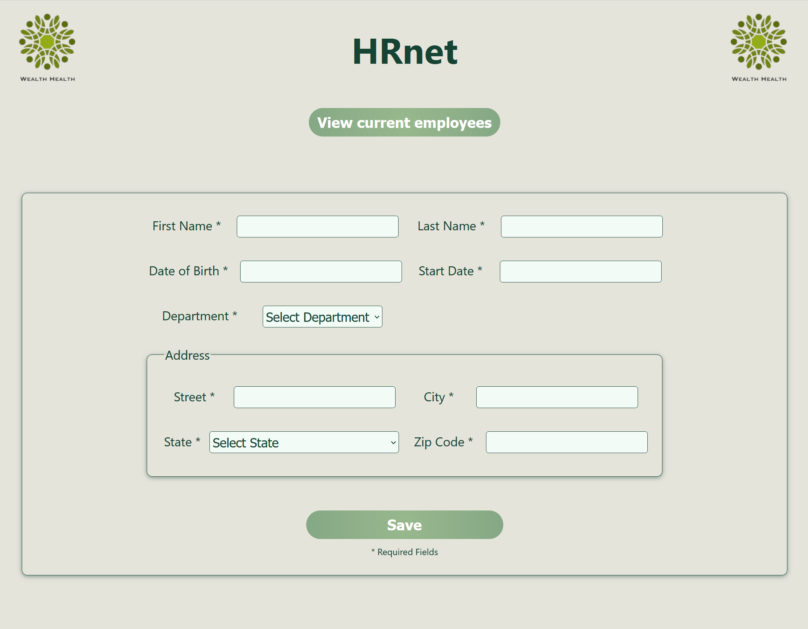
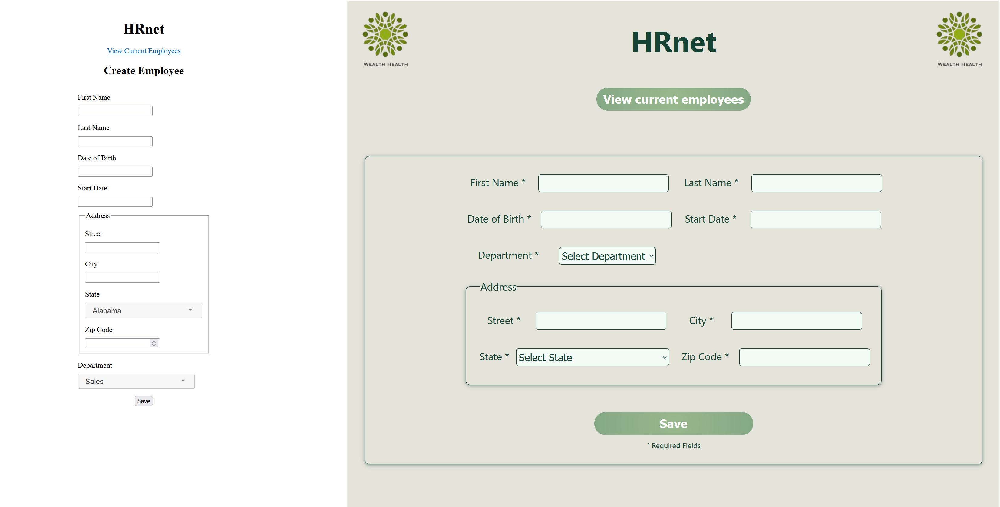

# HRnet React - Modernisation de l'Application de Gestion des Employés

<div align="center">


[](https://reactjs.org/)
[](https://vitejs.dev/)
[](https://developer.mozilla.org/en-US/docs/Web/JavaScript)
[](https://github.com/Nayel9/P14---HRnet/commits/main)
[](https://github.com/Nayel9/P14---HRnet)
[](https://opensource.org/licenses/MIT)

[Signaler un Bug](https://github.com/Nayel9/P14---HRnet/issues) | [Demander une Fonctionnalité](https://github.com/Nayel9/P14---HRnet/issues)

</div>

## 📌 Sommaire
- [Aperçu Rapide](#-aperçu-rapide)
- [Fonctionnalités](#-fonctionnalités)
- [Technologies Utilisées](#-technologies-utilisées)
- [Démarrage Rapide](#-démarrage-rapide)
- [Utilisation](#utilisation)
- [Tests](#tests)
- [Licence](#licence)
- [Contact](#auteur)

## 🚀 Aperçu Rapide

HRnet React est une refonte de l'application interne de gestion des employés pour WealthHealth. Cette version React remplace l'ancienne application jQuery, offrant une meilleure performance, une maintenance simplifiée et une expérience utilisateur améliorée.




### Avant vs Après





## ✨ Fonctionnalités

- 📝 Création facile de profils d'employés
- 📊 Affichage et gestion efficace des listes d'employés
- 🎛️ Composants React modulaires et réutilisables
- 🚀 Performance optimisée et temps de chargement réduits
- 📱 Interface responsive pour une utilisation sur tous les appareils

## 🛠 Technologies Utilisées

- **React** - Framework UI
- **Vite** - Build tool
- **JavaScript (ES6+)** - Langage de programmation
- **HTML5 & CSS3** - Structure et style

## 🏁 Démarrage Rapide

1.  **Cloner le dépôt:**

    ```
    git clone https://github.com/Nayel9/P14---HRnet.git
    cd P14---HRnet
    ```
2.  **Installer les dépendances:**

    ```
    npm install
    # ou
    yarn install
    # ou
    pnpm install
    ```
3.  **Démarrer l'application en mode développement:**

    ```
    npm run dev
    # ou
    yarn dev
    # ou
    pnpm dev
    ```

    L'application sera accessible à l'adresse `http://localhost:5173` (ou l'adresse indiquée par Vite).

## Utilisation

1.  **Création d'un Employé:**

    *   Naviguez vers la page "Create Employee".
    *   Remplissez le formulaire avec les informations de l'employé.
    *   Soumettez le formulaire pour ajouter l'employé à la liste.

2.  **Consultation de la Liste des Employés:**

    *   Naviguez vers la page "Employee Directory".
    *   Consultez la liste des employés avec leurs informations.

## Tests

*   **Tests Manuels:** Suivez les étapes décrites dans la section "Utilisation" pour tester les fonctionnalités principales de l'application.
*   **Tests de Performance (Lighthouse):**
    1.  Construisez l'application pour la production : `npm run build` ou `yarn build` ou `pnpm build`.
    2.  Servez l'application construite avec `npm run preview` ou `yarn preview` ou `pnpm preview`.
    3.  Ouvrez les outils de développement de votre navigateur (F12) et utilisez l'onglet "Lighthouse" pour effectuer un audit de performance.
    4.  Comparez les résultats avec l'ancienne version jQuery de HRnet.


## Licence

Ce projet est sous licence [MIT License](LICENSE).

## Auteur

[Nayel9](https://github.com/Nayel9)

---